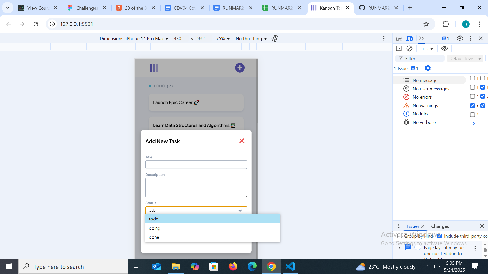
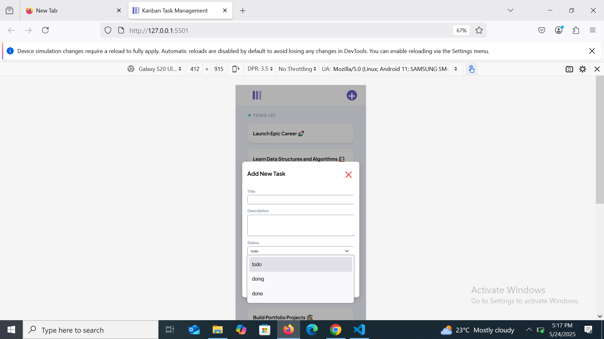

# Task Board with Local Storage Persistence and Task Creation

## Overview

This is a simple Kanban board web application for organizing tasks using status-based columns.The current implementation features a dynamic **Add New Task** modal that allows users to create new tasks with title, description,and status. The application saves tasks in the browser using localStorage ensuring persistence accross page reloads.

## Features

- **Add New Task** with title, description, and status inputs
- Tasks saved automatically to **localStorage**
- Task list persist accross browser refreshes
- Tasks displayed under appropriate columns: to Do, Doing, and Done
- Modal opens on **"+Add New Task"** button click
- Fully responsive layout via \*\* CSS media queries
- JSDoc comments included for maintainability

## Technologies Used

- **HTML5** - Page structure
- **CSS3** - Styling and responsive design
- **JavaScript** - Dynamic task logic and modal interaction
- **localStorage API** - Persistant storage in browser
- **JSDoc** - Code documentation

## Challenges faced

- The modal did not open on the button click initially - solved by ensuring that event listeners were attached inside the DOMContentLoaded event and that the modal element exists in the dom.
- The **+Add New Task** button disappeared completely on the mobile and tablet media querry - solved by removing the button from the **h2** tag and creating a separate div class for the button(button was nested in the wrong tag and div)

### Unresolved Challenge

- **Issue:** In Google Chrome (particularly on mobile view), the status dropdown overlaps the input area instead of appearing below it. However, the same dropdown works correctly in Mozilla Firefox, where it drops down as expected.There are tasks that I added on the task board and they only appear in Chrome and not on Mozilla Firefox,therefore, there is inconsistent Local Storage behavior accross browsers, please see screenshots.  
- **Status:** This issue is currently unresolved and appears to be browser-specific. Screenshots are included below for reference:

**Chrome:**

**Mozilla Firefox:**

## Setup Instructions

1. **Clone / download** the repo.
2. Open `index.html` with **Live Server** or any modern browser.

## How to Use

1.  Click on the **"+ Add New Task"** button at the top right corner of the page.
2.  Fill the modal form with: Title, Description, and Status(todo, doing, or done)
3.  Click **Create Task** to add the task.
4.  The task will immediately appear in the appropriate column.
5.  Tasks are automatically saved in localStorage

P.S I added new tasks on the board to see if I had fulfilled certain user stories.

This project is open for collaboration.My contacts are just below.

## Contact

[Runyararo Marongwe/mrunya87@gmail.com][https://github.com/Rue87]
